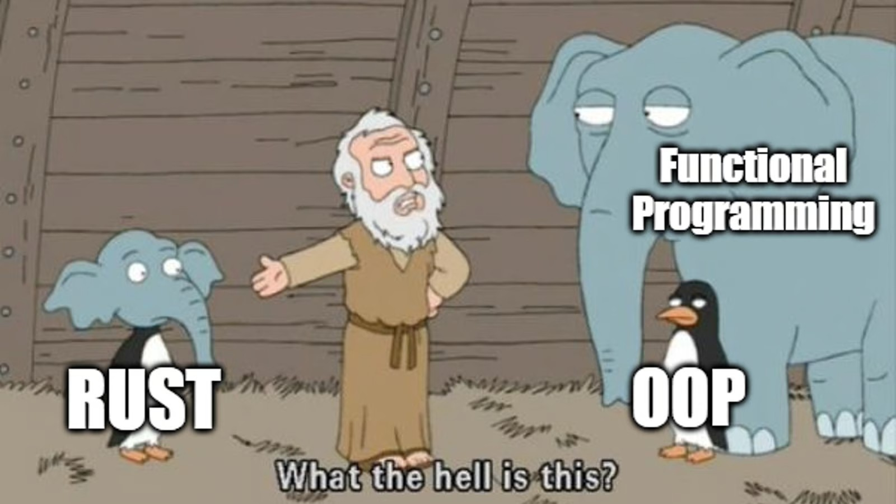
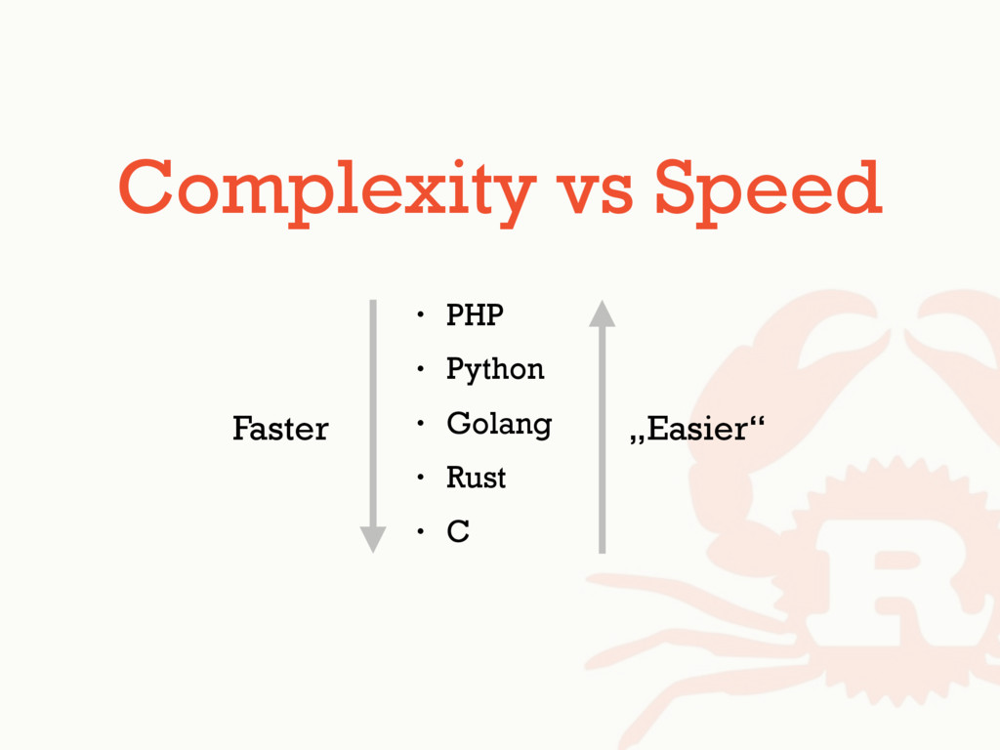
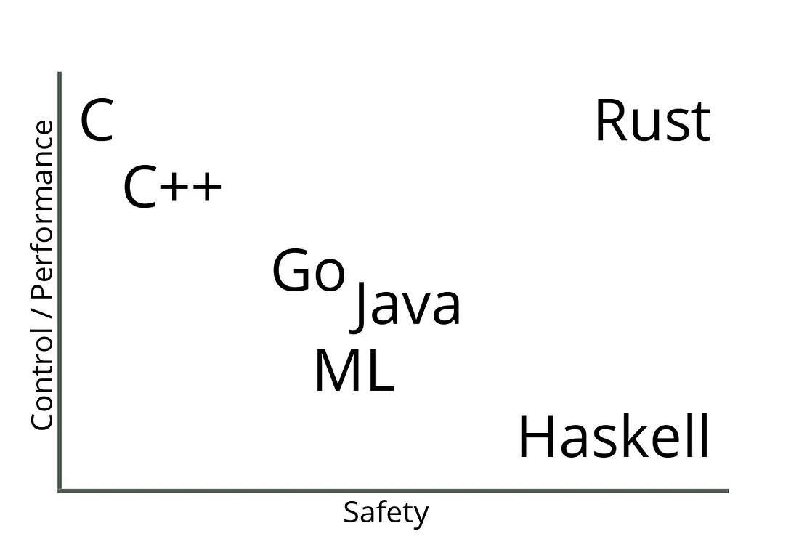

<div class="flex gap-8 items-center">

# Intro to Rust


</div>

<LightOrDark>
<template #dark>

</template>
<template #light>

</template>
</LightOrDark>

Charles Inwald & Liam Rust

---

# Goals

<v-clicks>

- Learn the syntax and the semantics of Rust

- Explore Rust's ownership model and error handling

- Understand concurrency

- Build a CLI program

</v-clicks>

---
layout: two-cols
layoutClass: gap-8
---

# What is Rust?

<v-clicks>

- Systems programming language focused on safety, speed, and concurrency

- Developed by Mozilla, now maintained by the Rust Foundation

- Memory safety without a garbage collector, avoiding common errors like null pointers and data races

</v-clicks>

::right::



---
layout: two-cols
layoutClass: gap-8
---

# Why Rust?

<v-clicks>

- Rust supports a mixture of imperative, procedural, concurrent actor, object-oriented and pure functional styles.

- Rust solves pain points present in many other languages

- **Statically-typed**: compiler checks constraints on the data and its behavior, alleviating cognitive overhead and misunderstandings

- High performance, low memory usage

</v-clicks>

::right::

<div class="grid place-items-center h-full">
    
    
</div>

---
layout: two-cols
layoutClass: gap-8
---

# Use after Free in C

- This program tries to access the memory of a pointer after the memory is freed causing undefined behavior

- It may print the wrong result, crash, or even work if you're lucky, but no one knows

- Rust's ownership and borrowing rules would prevent this by ensuring that once memory is freed, it cannot be accessed again. In Rust, if you try to use a value after it has been dropped (freed), the compiler will catch the error before the program runs

::right::

```c [use-after-free.c] {all|9|11-12}
#include <stdio.h>
#include <stdlib.h>

void unsafe_memory() {
    int *ptr = (*int)malloc(sizeof(int));
    *ptr = 42;
    printf("Value before free: %d\n", *ptr);

    free(ptr); // Free the allocated memory

    // Use-after-free: this causes undefined behavior
    printf("Value after free: %d\n", *ptr);
}

int main() {
    unsafe_memory();
    return 0;
}
```

---
layout: two-cols
layoutClass: gap-8
---

# Ownership Model

- Each value has a single owner

- When the owner goes out of scope, the value is dropped

- This helps prevent issues like double-free or dangling pointers by enforcing strict ownership rules at compile time

::right::

```rust {monaco-run} {autorun:false}
fn main() {
    let s1 = String::from("Hello, world!");
    // Ownership of s1 is moved to s2
    let s2 = s1;

    // Uncomment the next line and hit run!
    // println!("{}", s1);

    // s2 now owns the value
    println!("{}", s2);
}
```

---
layout: two-cols
layoutClass: gap-8
---

# Borrowing and References

- Allows you to reference data without taking ownership of it

- **Immutable Borrowing (`&T`)**: You can borrow a value as many times as you want, but you cannot modify it

- **Mutable Borrowing (`&mut T`)**: You can borrow a value mutably (allowing modification), but only one mutable reference is allowed at a time to prevent data races

::right::

```rust {monaco-run} {autorun:false}
fn main() {
    let mut s = String::from("Hello");

    // Immutable borrowing
    let len = calculate_length(&s);
    println!("The length of '{}' is {}.", s, len);

    // Mutable borrowing
    modify_string(&mut s);
    println!("After modification: '{}'", s);
}

// Immutable borrow function
fn calculate_length(s: &String) -> usize {
    s.len() // We can read from s but not modify it
}

// Mutable borrow function
fn modify_string(s: &mut String) {
    s.push_str(", world!"); // We can modify s
}
```

---
layout: two-cols
layoutClass: gap-8
---

# Structs

- Groups together related data, like objects in other languages

  - Immutable by default

- Fields can be accessed with dot notation

- Fields can own or borrow data

- Methods can operate on an instance of a struct

  - Have `self` as the first parameter

- Associated functions, don't operate on a particular instance

  - Defined in an `impl` block

::right::

```rust {monaco-run} {autorun:false}
// Define a structure representing a Rectangle
struct Rectangle {
    width: u32,
    height: u32,
}

// Implement methods for the Rectangle struct
impl Rectangle {
    // Method to calculate the area of the rectangle
    fn area(&self) -> u32 {
        self.width * self.height
    }

    // Associated function to create a square
    // (same width & height)
    fn square(size: u32) -> Rectangle {
        Rectangle {
            width: size,
            height: size,
        }
    }
}

fn main() {
    let rect = Rectangle { width: 30, height: 50 };
    println!("Area of rectangle: {}", rect.area());

    let sq = Rectangle::square(10);
    println!("Area of square: {}", sq.area());
}
```

---
layout: two-cols
layoutClass: gap-8
---

# Concurrency

- Ability to run multiple tasks in overlapping time periods (not necessarily simultaneously).

- **Data Race**: two or more threads access the same memory location concurrently, and at least one thread is modifying the data.

  1. Two or more threads access the same variable concurrently.

  1. At least one thread writes to the variable.

  1. No proper synchronization is used (e.g., locks or atomic operations).

::right::

```c [data-race.c] {all|4-9,14-16|6}
#include <stdio.h>
#include <pthread.h>
int counter = 0;
void *increment(void *arg) {
    for (int i = 0; i < 100000; i++) {
        count++;
    }
    return NULL;
}

int main() {
    pthread_t thread1, thread2;

    // Create two threads that both increment counter
    pthread_create(&thread1, NULL, increment, NULL);
    pthread_create(&thread2, NULL, increment, NULL);
    // Wait for both threads to finish
    pthread_join(thread1, NULL);
    pthread_join(thread2, NULL);
    // Final value of counter may not be
    // as expected due to data race
    printf("Final counter value: %d\n", counter);

    return 0;
}
```

---
layout: two-cols
layoutClass: gap-8
---

# Concurrency <span class="font-extralight text-rust-500">(cont.)</span>

- **Mutex**: The Mutex ensures that only one thread can modify the counter at a time, preventing data races.

- **Arc**: An atomic reference-counted pointer (Arc) is used to safely share the Mutex across multiple threads.

  - Atomic: can't be interrupted by other threads

  - Reference Counted: deallocated when zero

- **Locking**: The lock() method is used to acquire the lock on the Mutex, ensuring exclusive access during increments.

::right::

```rust {monaco-run} {autorun:false}
use std::sync::{Arc, Mutex};
use std::thread;

fn main() {
    let counter = Arc::new(Mutex::new(0));
    let mut handles = vec![];
    for _ in 0..2 {
        let counter = Arc::clone(&counter);
        let handle = thread::spawn(move || {
            for _ in 0..1_000_000 {
                let mut num = counter.lock().unwrap();
                *num += 1;
            }
        });
        handles.push(handle);
    }

    for handle in handles {
        handle.join().unwrap();
    }
    println!(
        "Final counter value: {}",
        *counter.lock().unwrap()
    );
}
```

---
layout: two-cols
layoutClass: gap-8
---

# Lifetimes

- Lifetimes define how long a reference is valid in memory.

- Prevents dangling references (references to data that no longer exists).

- Ensure memory safety by enforcing strict borrowing rules.

**`'static`** - explicitly specifies reference that lasts the entirety of the program

Rust often infers the lifetime, but you may need to explicitly annotate from time to time

::right::

```rust {monaco-run} {autorun:false}
// This function attempts to return a reference
// to a local variable, which is not allowed
fn dangling_reference<'a>() -> &'a str {
    let string = String::from("Hello, Rust!");

    &string
}

fn main() {
    let result = dangling_reference();
    println!("Result: {}", result);
}
```

<!--
```rust
fn no_dangling_reference<'a>(input: &'a str) -> &'a str {
    input
}

fn main() {
    let string = String::from("Hello, Rust!");
    let result = no_dangling_reference(&string);
    println!("Result: {}", result);
}
```
-->

---
layout: two-cols
layoutClass: gap-8
---

# Pattern matching

- Simplifies code by matching values against patterns and executing corresponding code blocks

- `match` statement: Like a switch statement, it can be used instead of a bunch of `if`/`else` statements

  - Must cover all possible cases

- Wildcard Pattern: Used for cases not covered, defined with a `_`

::right::

```rust {monaco-run} {autorun:false}
fn main() {
    let number = 5;
    match number {
        1 => println!("One"),
        2 => println!("Two"),
        3 | 4 => println!("Three or Four"),
        _ => println!("Other")
    }
}
```

---

# Activity

<div class="h-full grid grid-cols-2 gap-8 mt-8">
<div class="flex flex-col items-center gap-8">

## These slides

<qrcode class="p-4 bg-white rounded-xl" value="https://drive.google.com/file/d/17vjYc77oE53Z1Xart7hJsYTq9Xs4PjyU/view?usp=sharing" render-as="svg" size=200 />
<h2>https://bit.ly/rust-slides</h2>
</div>
<div class="flex flex-col items-center gap-8">

## Activity

<qrcode class="p-4 bg-white rounded-xl" value="https://bit.ly/rust-activity" render-as="svg" size=200 />
<h2>https://bit.ly/rust-activity</h2>

</div>
</div>
